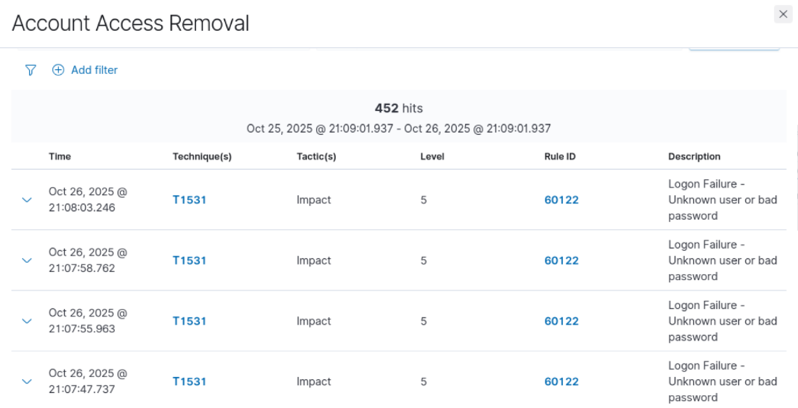

# 🚀 Project 1: SIEM Lab Implementation and Operation (Wazuh/Kibana)

## 🎯 Project Goal

The primary objective was to deploy a comprehensive Security Information and Event Management (SIEM) laboratory environment (Ubuntu, Windows, Kali Linux) to centralize security logs, **demonstrating critical security visibility** and threat detection capabilities, aligning with MITRE ATT&CK methodology.

## 🧱 Lab Architecture and Components

| Component | Role | IP Address | Status |
| :--- | :--- | :--- | :--- |
| **Ubuntu Server** | Wazuh Manager, Indexer & Dashboard (SIEM Core) | 192.168.1.9 | Operational |
| **Windows 10 Pro** | Wazuh Agent (Monitored Endpoint) | 192.168.1.8 | Active |
| **Kali Linux** | Wazuh Agent (Monitored Endpoint / Attacker) | 192.168.1.7 | Active |

## ⚙️ Implementation Milestones and Key Achievements

### A. Endpoint Deployment and Configuration

* **Agent Deployment Configuration (Photo A):** Initiated the Windows Agent deployment by configuring the server address to the Wazuh Manager's IP (`192.168.1.9`) and executing the installation via PowerShell.

    > 

* **PowerShell (Photo B):** window executing the command to download and install the Wazuh agent on Windows, pointing to 192.168.1.9
    > 

* **Endpoints (Photo C):** summary in Wazuh, showing 1 active agent (Windows) in the 'default' group.

    > 

* **Discover (Photo D):** view in Wazuh showing search results (804 hits) and log details (agent.id: exists).

    > 

* **Active Agents (Photo 5):** The final Dashboard view validates that both agents, Windows (`001`) and Kali (`002`), are **active** and successfully reporting to the SIEM.

    > 

* **Advanced Filtering (SOC Skill):** Demonstrated proficiency in using the Wazuh Dashboard's Discover module to locate specific security events by applying precise filters on event fields such as:
    * **Agent Name** (`agent.name: Kali`).
    * **Rule Groups** (`rule.groups: syscheck`).
    * **Numerical Operators** (`is between` for `rule.level` 10 to 16).

    > 

## 📸 6. Threat Detection and Log Analysis (FOTO 6)

* **Goal:** Wazuh Dashboard (Security Events): This image confirms the successful detection of a malicious activity. It shows multiple Logon Failure alerts (Rule ID 60122, Level 5), indicating a brute-force attempt to gain unauthorized local access to the Windows endpoint. This validates the agent's ability to monitor critical security logs and the Manager's capability to process and classify the activity according to the MITRE ATT&CK Tactic: Impact and Technique T1531 (Account Access Removal).
   > 

* ### ⚠️ Troubleshooting and Remediation

During the lab setup, the network IPs for the virtual machines changed (e.g., Wazuh Manager moved from 192.168.1.9 to 192.168.10.107). This caused the agents to disconnect.

**Action Taken:**
1.  Identified the new Manager IP.
2.  Manually updated the `<address>` field in the `ossec.conf` file on both the Windows and Kali agents.
3.  Restarted the `WazuhSvc` on Windows and `wazuh-agent` service on Kali.

**Result:** Restored full connectivity, enabling the SIEM to proceed with log collection and threat detection.
    

---
