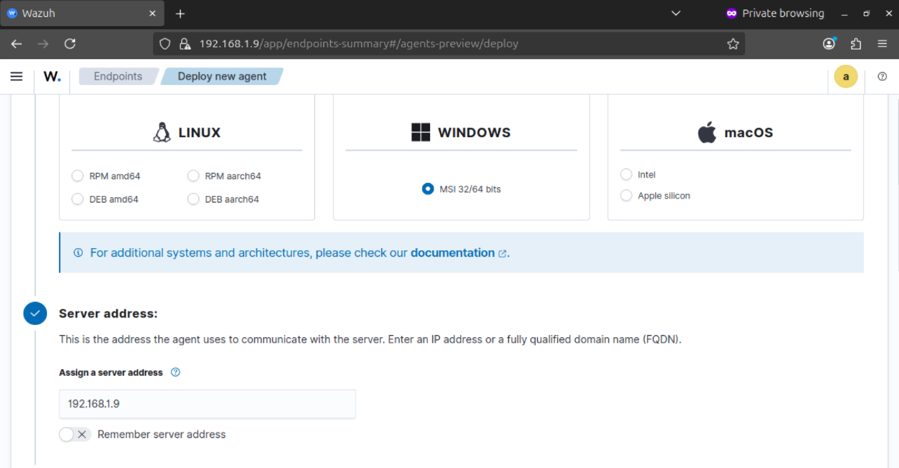
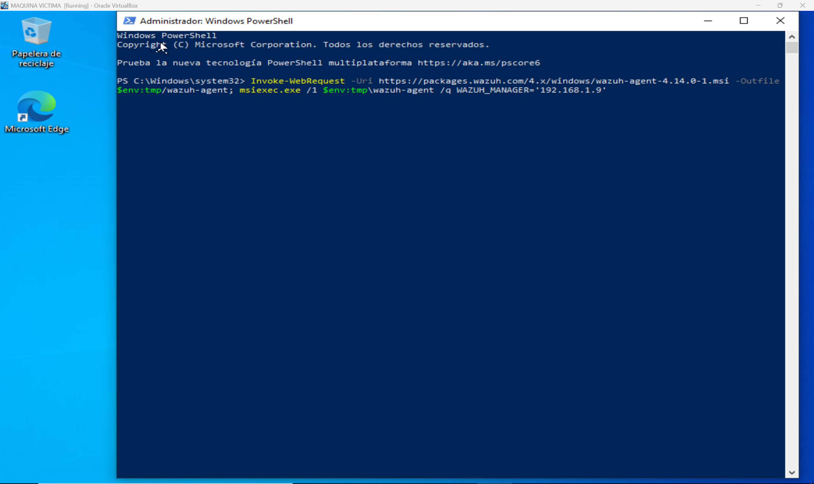
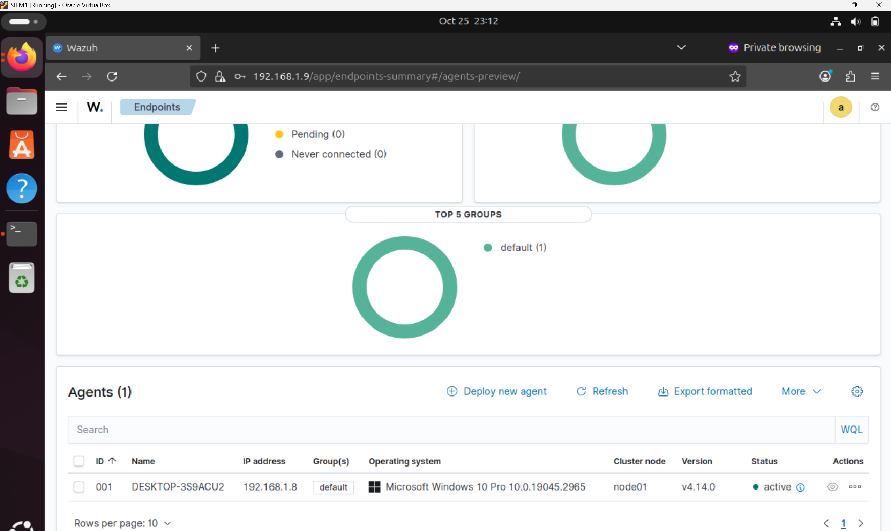
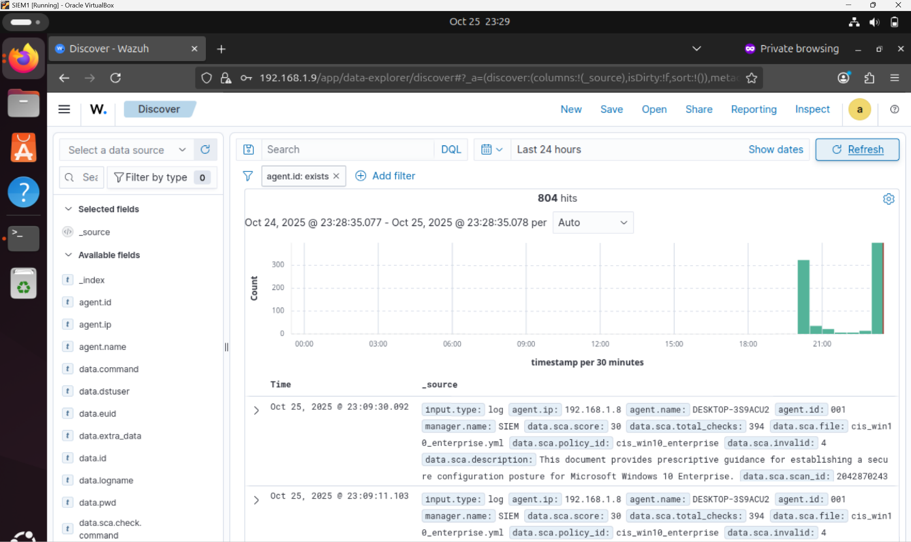
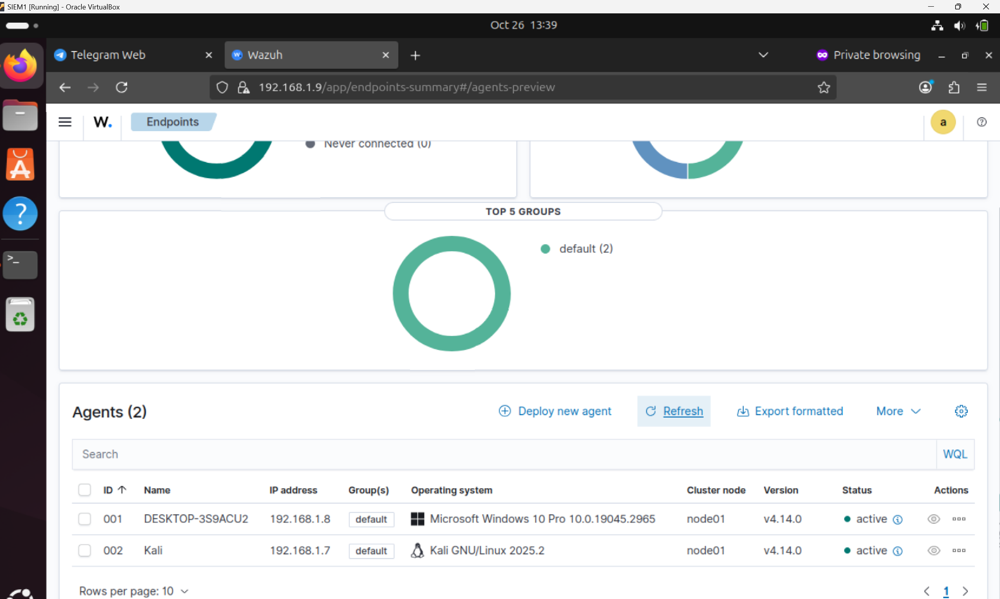
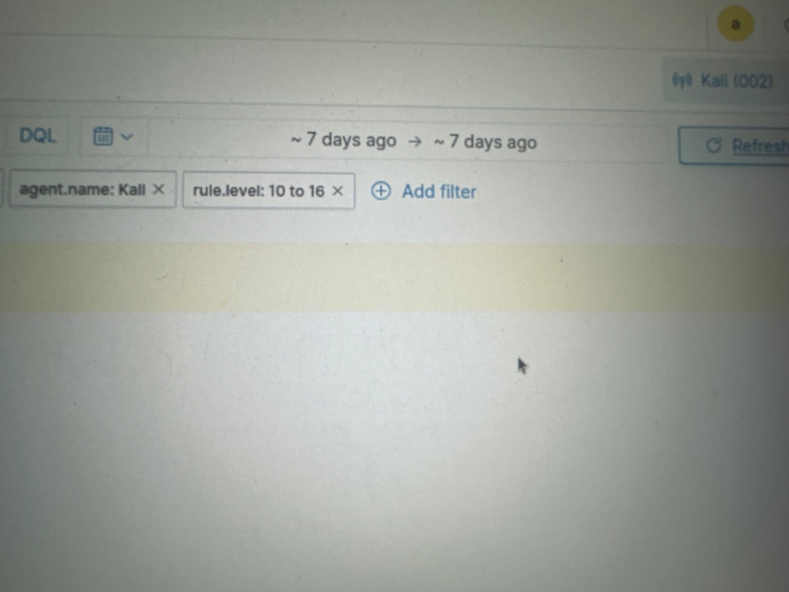

# 🚀 Project 1: SIEM Lab Implementation and Operation (Wazuh/Kibana)

## 🎯 Project Goal

The primary objective was to deploy a comprehensive Security Information and Event Management (SIEM) laboratory environment (Ubuntu, Windows, Kali Linux) to centralize security logs, **demonstrating critical security visibility** and threat detection capabilities, aligning with MITRE ATT&CK methodology.

## 🧱 Lab Architecture and Components

| Component | Role | IP Address | Status |
| :--- | :--- | :--- | :--- |
| **Ubuntu Server** | Wazuh Manager, Indexer & Dashboard (SIEM Core) | 192.168.1.9 | Operational |
| **Windows 10 Pro** | Wazuh Agent (Monitored Endpoint) | 192.168.1.8 | Active |
| **Kali Linux** | Wazuh Agent (Monitored Endpoint / Attacker) | 192.168.1.7 | Active |

## ⚙️ Implementation Milestones and Key Achievements

### A. Endpoint Deployment and Configuration

* **Agent Deployment Configuration (Photo A):** Initiated the Windows Agent deployment by configuring the server address to the Wazuh Manager's IP (`192.168.1.9`) and executing the installation via PowerShell.

    > 

* **PowerShell (Photo B):** window executing the command to download and install the Wazuh agent on Windows, pointing to 192.168.1.9
    > 

* **Endpoints (Photo C):** summary in Wazuh, showing 1 active agent (Windows) in the 'default' group.

    > 

* **Discover (Photo D):** view in Wazuh showing search results (804 hits) and log details (agent.id: exists).

    > 

* **Active Agents (Photo 5):** The final Dashboard view validates that both agents, Windows (`001`) and Kali (`002`), are **active** and successfully reporting to the SIEM.

    > 

* **Advanced Filtering (SOC Skill):** Demonstrated proficiency in using the Wazuh Dashboard's Discover module to locate specific security events by applying precise filters on event fields such as:
    * **Agent Name** (`agent.name: Kali`).
    * **Rule Groups** (`rule.groups: syscheck`).
    * **Numerical Operators** (`is between` for `rule.level` 10 to 16).

    > 

## 📸 Evidence of Detection (FOTO 6 - *Pending*)

* **Goal:** The final piece of evidence is a screenshot showing that the SIEM successfully detected and indexed an event sent from the Kali or Windows endpoint, proving the end-to-end functionality of the system.
    
*(**Insert FOTO 6 here once the event appears in Discover**)*

---
